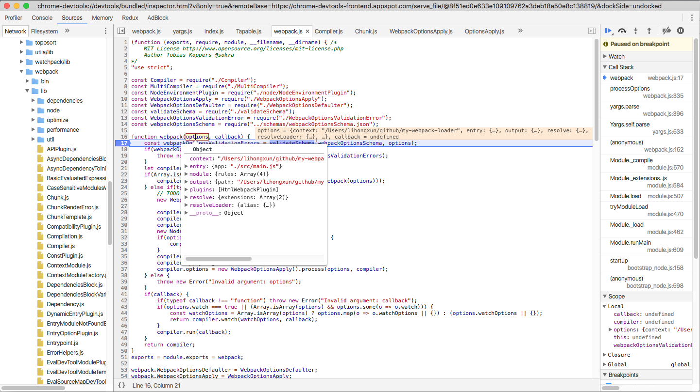
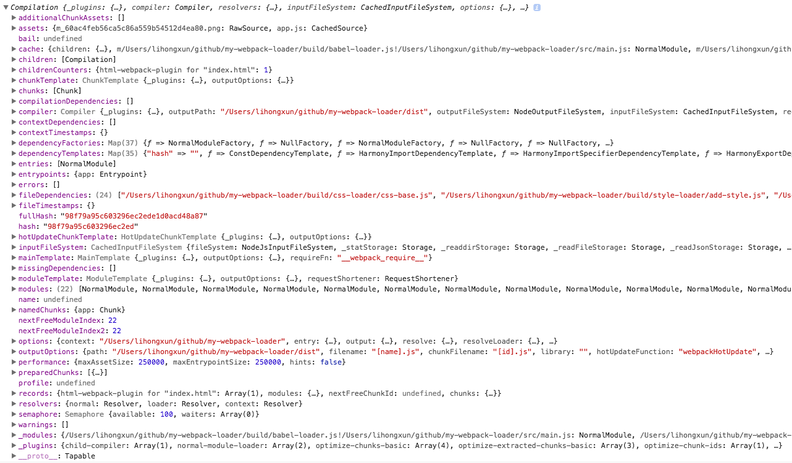

# webpack 源码分析六：webpack 处理流程分析

# 如何使用 Chrome 调试 webpack 源码

阅读源码最直接的方式是在 chrome 中通过断点在关键代码上进行调试，这样通常能解决只看代码有的时候会出现看不懂，或者跳来跳去容易被绕晕的问题。那么下面说一下我是如何调试 webpack 源码的。

我们可以用 `node-inspector` 在 chrome 中调试 nodejs 代码，这比命令行中调试方便太多了。nodejs 从 v6.x 开始已经内置了一个 inspector，当我们启动的时候可以加上 `--inspect` 参数即可:

```js
node --inspect app.js
```

然后打开 chrome，打开一个新页面，地址是： `chrome://inspect`，就可以在 chrome 中调试你的代码了。

如果你的 JS 代码是执行一遍就结束了，可能没时间加断点，那么你可能希望在启动的时候自动在第一行自动加上断点，可以使用这个参数 `--inspect-brk`，这样会自动断点在你的第一行代码上。

那么如何 debug 我们的 webpack 呢，我是这么做的：

```js
node --inspect-brk ./node_modules/webpack/bin/webpack.js --config webpack.pro.js
```

第一行代码就暂停了，会发现在文件列表中找不到其他文件，不用急，当 执行到 `require` 的时候，对应的文件就出来了。

Chrome 中调试 webpack 截图如下：



这样就可以一边看源码，一遍断点调试了，非常方便。

# 我们只看主线剧情

Webpack 源码是一个插件的架构，他的很多功能都是通过诸多的内置插件实现的。Webpack 为此专门自己写一个插件系统，叫 [Tapable](https://github.com/webpack/tapable) 主要提供了注册和调用插件的功能。

因为 webpack 的源码比较复杂，而且基本没有任何注释，所以想完全看完他的代码是非常困难的，这里我们以一个*主线剧情*来阅读他的源码。那么主线剧情是什么呢？我的定义是：从配置文件读取 `entry` 开始，到最后输出 `bundle.js` 的过程，就是主线，在这个过程中的一些不重要的环节我们尽量省略。

那么在这个主线中我们关心什么呢？我们应该关心如下几点：

1. webpack 的编译过程主要有哪些阶段？（生命周期）
2. webpack 是如何 从 entry 开始解析出整个依赖树的？
3. loaders 是在何时被调用的？
4. 最终是如何知道要生成几个文件，以及每个文件的内容的？
   而其他一些不重要的问题我们尽量忽略，比如如何解析配置，如何处理错误，HASH 规则等。等看完主线流程后再回头单独看这些点。

带着上面的四个问题，我们开始看 webpack 的源码。

# 对 webpack 源码的吐槽

webpack 源码看起来比较痛苦，这里吐槽几个点：

1. 通篇几乎没有任何注释
2. 不用的函数经常会起同样的名字，或者是函数名太抽象导致看不出他是干什么的。比如 插件的 `apply` 方法 就很容易和 js 内置的 `apply` 混淆。比如 `doBuild` 和 `build`.
3. 生命周期异常复杂，并且 `compiler` 和 `compilation` 各自有自己的生命周期，也有没有任何说明。
4. 代码逻辑跳转跨度非常大，很多时候一个方法开始会经过各种回调以及生命周期的跳转，比如 `compilation.seal` 就经过了很多层的跳转最后才进入 `MainTempalate` 中。

所以强烈推荐通过断点逐步调试代码，并且可以分阶段，一次只关注一个点，不要试图一次走完弄懂所有流程。

吐槽完毕，后面就专心看代码不再吐槽。

# webpack 的插件架构

webpack 整体上是一个插件的架构，绝大多数功能都是通过插件实现的。
这里有一点比较容易让人迷惑，webpack 的插件有一个 apply 方法，他是在 webpack 的生命周期上再注册一些回调函数。所以插件有两个阶段：

- 注册阶段，每个插件会在自己需要的生命周期上注册自己的回调
- 编译阶段，webpack 会把编译过程分为很多个生命周期，在编译启动后，会通过 `applyPlugins(name)` 各个生命周期中调用对应的回调函数。

# 梳理 webpack 工作流程

webpack 的流程，我画了一个图来表示：


我们从 `bin/webpack.js` 开始，假设我们有一个 `main.js` 作为入口文件。

**bin/webpack.js**
注意区分有两个 `webpack.js`，其中 `bin/webpack.js` 是处理命令行相关的参数的，也是我们通过命令行直接启动的入口，而 `lib/webpack.js` 是 webpack 的逻辑入口。为什么有两个呢？因为 webpack 既可以当做 命令行工具用，也可以在 node 中调用。下面如果没有特别标注的都是指 `lib` 目录下的文件

这里面会先调用 `yargs` 处理命令行传入的参数，
然后会调用 new Webpack()

**webpack.js**

`new Webpack` 的时候会创建一个 `compiler` 并且会根据我们的配置把插件都注册好

```js
function webpack(options, callback) {
  // 参数 options 就是我们的配置，当然是经过一些处理的
  // 省略 validate 和 multiCompiler 处理代码

  compiler = new Compiler()
  compiler.context = options.context
  compiler.options = options
  new NodeEnvironmentPlugin().apply(compiler)
  if (options.plugins && Array.isArray(options.plugins)) {
    compiler.apply.apply(compiler, options.plugins) // 这里是我们配置的插件，会注册一些回调
  }
  compiler.applyPlugins('environment') // applyPlugins 就是调用由插件注册在对应名字的生命周期上的回调函数，这里就是处理 environment 相关的
  compiler.applyPlugins('after-environment')
  compiler.options = new WebpackOptionsApply().process(options, compiler) // 根据我们的配置，会注册对应的内部插件

  // 省略 callback
  return compiler
}
```

**WebpackOptionsApply**

Webpack Options Apply 会根据配置注册对应的内部插件。首先他会注册一个处理 Entry 的插件：

```js
compiler.apply(new EntryOptionPlugin()) // 这个插件会注册一个 `entry-option` 回调，里面会处理entry
compiler.applyPluginsBailResult('entry-option', options.context, options.entry) // 触发 `entry-option`
```

对 entry 的处理了，这里只是注册了插件，而最终会在 make 阶段把我们的 entry 解析成一个 module。解析的时候最核心的方法是 `parser.parse`，他会解析出一个 AST 语法树，并且遍历这个语法树，对所有的 `import` 进行依赖收集。

然后接下来会注册一大堆的内部插件：

```js
compiler.apply(
  new CompatibilityPlugin(),
  new HarmonyModulesPlugin(options.module),
  new AMDPlugin(options.module, options.amd || {}),
  new CommonJsPlugin(options.module),
  new LoaderPlugin()
  // 省略
)

compiler.apply(
  new EnsureChunkConditionsPlugin(),
  new RemoveParentModulesPlugin(),
  new RemoveEmptyChunksPlugin()
  // 省略
)
```

**bin/webpack.js**
又回到 `bin/webpack.js` 这里，如果没有 `watch` 模式的话，直接调用 `compiler.run`

**compiler.js**

`compiler.run` 方法会启动编译，然后在不同的生命周期调用对应的插件（的回调函数），主要有这么几个生命周期：

1. before-run
2. run
3. before-compile
4. compile
5. this-compilation
6. compilation 这里进行一些代码编译的准备工作
7. make 这里进行代码编译
8. after-compile 这里会根据编译结果 合并出我们最终生成的文件名和文件内容。

下面我们从 entry 开始，看看对 entry 的处理流程：

`WebpackOptionsApply.js` 这个文件中注册一个 `EntryOptionsPlugin` 插件

```js
compiler.apply(new EntryOptionPlugin())
compiler.applyPluginsBailResult('entry-option', options.context, options.entry)
```

然后 `EntryOptionPlugin` 又会调用 `SingleEntryPlugin`，进入到这里：

```js
    apply(compiler) {
        compiler.plugin("compilation", (compilation, params) => {
            const normalModuleFactory = params.normalModuleFactory;

            compilation.dependencyFactories.set(SingleEntryDependency, normalModuleFactory);
        });

        compiler.plugin("make", (compilation, callback) => {
            const dep = SingleEntryPlugin.createDependency(this.entry, this.name);
            compilation.addEntry(this.context, dep, this.name, callback);
        });
    }
   static createDependency(entry, name) {
        const dep = new SingleEntryDependency(entry);
        dep.loc = name;
        return dep;
    }
```

在 compilation 阶段会记录好依赖的工厂类，然后在 `make` 阶段的时候会创建一个 `SingleEntryPlugin` 实例，然后调用 `compilation.addEntry` 方法。

`compilation` 是一个编译对象，他会存储编译一个 `entry` 的所有信息，包括他的依赖，对应的配置等。一般我们会有两个 `compilation` 对象，一个处理我们配置的 `entry` （entry 中有多个 `chunk` 也是同一个 `compilation` 处理的，不过他会分别处理），因为 `index.html` 的编译也是独立进行的。

`addEntry` 会调用 `_addModuleChain` 方法，最终经过几次调用后会进入到 `NormalModule.js` 中的 `build` 方法。

因为 `build` 方法会先调用 `doBuild` 那么我们先看看 `doBuild` 是做什么的：

```js
// 其实很容易看出来，doBuild 方法就是调用了相应的 `loaders` ，把我们的模块转成标准的JS模块，无论这个模块是JS、CSS还是图片。也就是说，我们在webpack配置文件中配置的loaders，就是在这里进行调用的。
// 这里以我们直接通过 `babel-loader` 来编译 `main.js` 为例，那么这个函数就是调用 `babel-loader` 来编译 `main.js` 的源码，并返回编译后的结果对象 result
// result 是一个数组，数组的第一项就是编译后的代码，还记得前面讲babel-loader 的实现原理么，这个result 就是我们的 babel-loader 返回的结果
// 不止entry文件会在这里调用loader，它依赖的任何一个模块都会在这里调用，比如css模块，就会在这里调用对应的css-loader和style-loader把它转换成JS对象
doBuild(options, compilation, resolver, fs, callback) {
        this.cacheable = false;
        const loaderContext = this.createLoaderContext(resolver, options, compilation, fs);

        runLoaders({
            resource: this.resource,  // 假设这里是 /xxx/main.js
            loaders: this.loaders, // 这里一般是 `
            context: loaderContext,
            readResource: fs.readFile.bind(fs)
        }, (err, result) => {
            if(result) {
                this.cacheable = result.cacheable;
                this.fileDependencies = result.fileDependencies;
                this.contextDependencies = result.contextDependencies;
            }

            const resourceBuffer = result.resourceBuffer;
            const source = result.result[0]; // 这里就是 babel-loader 编译后的代码
            const sourceMap = result.result[1];

            // this._source 是一个 对象，有name和value两个字段，name就是我们的文件路径，value就是 编译后的JS代码
            this._source = this.createSource(asString(source), resourceBuffer, sourceMap);
            return callback();
        });
    }
```

经过 `doBuild` 之后，我们的任何模块都被转成了标准的 JS 模块，那么下面我们就可以编译 JS 了。

```js
build(options, compilation, resolver, fs, callback) {
        // 一些变量初始化 省略

        return this.doBuild(options, compilation, resolver, fs, (err) => {
            // 省略一些不重要的代码
           // 源码经过loader编译已经成为标准的JS代码，下一步就是调用 parser.parse 对JS代码进行语法解析
                this.parser.parse(this._source.source(), {
                    current: this,
                    module: this,
                    compilation: compilation,
                    options: options
                });
                callback();
        });
    }
```

那么我们来看看 `parser.parse` 的代码：

```js
    parse(source, initialState) {
        let ast = acorn.parse(source); // 简化了代码，这里的一大段其实就是这一句。调用 acorn 对JS进行语法解析，acorn 就是一个JS的 parser
        // 省略一些代码
        if(this.applyPluginsBailResult("program", ast, comments) === undefined) {
            this.prewalkStatements(ast.body);
            this.walkStatements(ast.body);
        }
        return state;
    }
```

显然如果我们有 `import a from 'a.js'` 这样的语句，那么经过 babel-loader 之后会变成 `var a = require('./a.js')` ，而对这一句的处理就在 `walkStatements` 中，这里经过了几次跳转，最终会发现进入了 `walkVariableDeclarators` 方法，因为我们这是声明了一个 `a` 变量。那么这个方法的主要内容如下：

```js
    walkVariableDeclarators(declarators) {
        declarators.forEach(declarator => {
            switch(declarator.type) {
                case "VariableDeclarator":
                    {
                        // 省略
                            this.walkPattern(declarator.id); // 这里就是我们的变量名， `a`
                            if(declarator.init)
                                this.walkExpression(declarator.init); // 这里就是我们的表达式 `require('./a.js')`
                        }
                        break;
                    }
            }
        });
    }
```

然后 会进入到 `walkCallExpression` ，显然因为 `require('./a.js')` 本身就是一个函数调用。最终会发现进入了 `call require` 的生命周期，这时会调用注册在这些生命周期上的插件了，这里会进入 `AMDRequireDependenciesBlockParserPlugin.js` 中，在这里就会创建一个依赖，记录下对 `a.js` 模块的依赖关系，最终这些依赖会被放到 `module.dependencies` 中。

收集完所有依赖之后，最终又会回到 `compiler.js` 中的 compile 方法里，他会调用 `compilation.seal` 方法，这个方法就会把所有依赖的模块都通过对应的模板 `render` 出一个拼接好的字符串，比如 `app.js` 的内容就是在这里拼接的，而 `render` 生命周期就是专门进行 JS 代码拼接的，
经过`seal` 之后，module 中的 `asset` 字段里面就有了最终编译出的文件对应的源码，截图如下：


这个截图就是我的 `main.js` 对应的 `compilation.assets`，可以看到他包含了这个 entry 会编译出的两个文件，一个是 `app.js` 一个是依赖的一张图片。

`seal` 函数最主要是调用了这行代码：

```js
self.createChunkAssets() // 把相关的JS模块的代码都收集起来，其实 `app.js` 就是一个 chunk，如果你有配置commen chunk的话，这里可能会有不止一个chunk
```

这个方法会遍历 `this.chunks` ，然后生成对应的文件的内容，比如我们如果是 `main.js` 入口，那么这里就只有一个 `chunk` 就是 `main.js` ，如果我们有多个 entry，那么这里就有多个 `chunks`。然后他的 `dependencies` 中记录了自己依赖的 `modules`，这样就形成了一颗完整的依赖树。把这个 `chunk` 传给 `MainTemplate` 中的 `render` 插件，他就会根据这颗依赖树生成最终的代码。

MainTemplate 中的 `render` 插件：

```js
this.plugin(
  'render',
  (bootstrapSource, chunk, hash, moduleTemplate, dependencyTemplates) => {
    const source = new ConcatSource()
    source.add('/******/ (function(modules) { // webpackBootstrap\n')
    source.add(new PrefixSource('/******/', bootstrapSource))
    source.add('/******/ })\n')
    source.add(
      '/************************************************************************/\n'
    )
    source.add('/******/ (')
    const modules = this.renderChunkModules(
      chunk,
      moduleTemplate,
      dependencyTemplates,
      '/******/ '
    ) // 这里会遍历所有的依赖，递归进行render
    source.add(
      this.applyPluginsWaterfall(
        'modules',
        modules,
        chunk,
        hash,
        moduleTemplate,
        dependencyTemplates
      )
    )
    source.add(')')
    return source
  }
)
```

这个就是对一个 JS 模块应该如何生成他的代码。

还记得我们前面讲到的，webpack 最终生成的代码中的依赖顺序是 中序遍历的结果，上面的 `renderChunkModules` 就是他进行中序遍历的地方。为什么要中序遍历，而不是先序或者后序呢，因为中序遍历就是一个简单的递归，是最好实现的。而 webpack 只要知道每个模块的对应关系即可，对顺序其实没有要求，那么就自然会选择最好事先的中序遍历。

# 总结 webpack 流程

到此为止，我们从代码上大概理清楚了 webpack 是如何编译我们的源码的。总结下来主要是如下几步：

1. 根据我们的 webpack 配置注册号对应的插件
2. 调用 compile.run 进入编译阶段，
3. 在编译的第一阶段是 `compilation`，他会注册好不同类型的 module 对应的 factory，不然后面碰到了就不知道如何处理了
4. 进入 `make` 阶段，会从 `entry` 开始进行两步操作：
5. 第一步是调用 loaders 对模块的原始代码进行编译，转换成标准的 JS 代码
6. 第二步是调用 acorn 对 JS 代码进行语法分析，然后收集其中的依赖关系。每个模块都会记录自己的依赖关系，从而形成一颗关系树
7. 最后调用 `compilation.seal` 进入 `render` 阶段，根据之前收集的依赖，决定生成多少文件，每个文件的内容是什么

这只是非常非常粗略的流程，实际上在整个过程中 webpack 的生命周期包含几十个点，感觉很难完全搞清楚每一步都是干什么的（其实也没有必要）。

# 补充 compilation 对象

每一个 入口文件会生成一个 compilation 对象，这个对象存储了编译这个入口需要的所有信息，比如 输入 输出路径，模块依赖等，整个编译的过程都是围绕 `compilation` 进行的。
如果我们只有一个入口文件，一般也会有两个 `compilation` 对象，那是因为一般我们都会用

一个典型的 compilation 对象如下：


